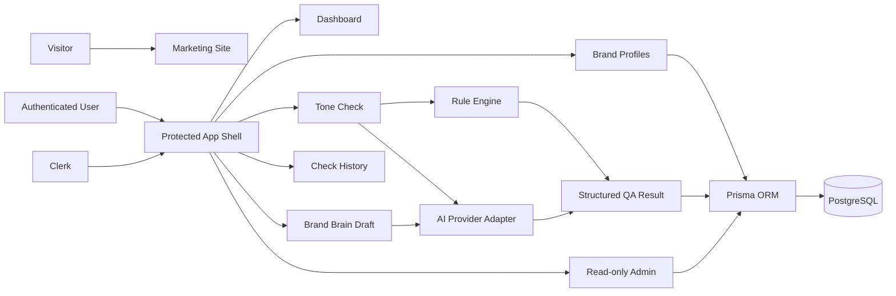

# Brand Tone Checker

Brand Tone Checker 是一个面向品牌团队、内容团队和代理商的 Brand QA SaaS MVP。它帮助团队在内容发布前检查文案是否符合既有品牌语气、表达规范和渠道语境，并把检查结果保存为可追溯的历史报告。

当前项目代号也包含「对味 / Duiwei AI」的产品表达。产品重点不是生成更多文案，而是在发布前回答一个更具体的问题：这条内容是否对味，哪里不对，应该怎么改。

## 产品定位

Brand Tone Checker 定位为轻量级品牌内容质检平台。

- 面向内容发布前的 QA 流程，而不是通用 AI 写作。
- 面向可复用的品牌标准，而不是一次性 Prompt。
- 面向团队交付、复盘和审计，而不是个人灵感辅助。
- 面向多品牌、多渠道内容团队，尤其适合代理商和小型品牌运营团队。

## 核心功能

- 营销官网：展示产品价值、适用场景、工作流和定价占位。
- Clerk 登录注册：提供受保护的应用区和用户身份。
- Dashboard：登录后的工作台入口。
- Brand Profile：维护品牌名称、受众、语气标签、禁用词、必用词和示例文案。
- Brand Brain 草稿生成：从品牌素材中生成可编辑的品牌大脑草稿，并保存为 Brand Profile。
- Tone Check：结合品牌档案、平台、受众、目标和语言，检查待发布文案。
- 规则引擎：执行非 AI 的基础规则检查，例如禁用词、必用词、长度和重复表达。
- AI 质检：通过 OpenAI-compatible provider 生成结构化质检结果。
- 结果报告：展示分数、最终结论、证据、建议、改写、命中规则和上下文。
- 历史记录：保存、筛选、查看和删除过往质检报告。
- Admin 只读后台：查看用户、品牌档案、质检数量和 AI 调用日志。
- 中英文界面：通过内置字典和语言切换器提供双语展示。

## 截图

截图文件预留在 `docs/images/`。即使图片尚未生成，以下 Markdown 引用也保留，方便后续补齐项目展示素材。


## 技术栈

- Next.js 15 App Router
- React 19
- TypeScript
- Tailwind CSS 4
- Clerk authentication
- Prisma ORM
- PostgreSQL
- OpenAI-compatible AI provider abstraction
- Node.js built-in test runner
- ESLint 9
- pnpm
- Vercel-ready deployment

## 系统架构



核心边界：

- `app/` 负责路由、页面和 server actions。
- `components/` 负责可复用 UI 和产品界面。
- `lib/` 负责业务规则、AI provider 抽象、Prompt 构建、历史结果读写和 i18n。
- `prisma/` 负责数据库 schema 和迁移。
- `docs/` 负责产品、架构、部署和开发文档。

更多说明见 [docs/architecture.md](docs/architecture.md)。

## 快速开始

### 1. 安装依赖

```bash
pnpm install
```

### 2. 准备环境变量

复制 `.env.example` 为 `.env`，并填入本地数据库、Clerk 和 AI provider 配置。

```bash
cp .env.example .env
```

Windows PowerShell 可使用：

```powershell
Copy-Item .env.example .env
```

### 3. 生成 Prisma Client

```bash
pnpm prisma:generate
```

### 4. 运行数据库迁移

```bash
pnpm prisma:migrate
```

### 5. 启动开发服务

```bash
pnpm dev
```

打开 `http://localhost:3000`。

## 环境变量

基础应用：

| 变量 | 说明 |
| --- | --- |
| `DATABASE_URL` | PostgreSQL 连接字符串。 |
| `DIRECT_URL` | Prisma direct connection，可用于部分托管数据库或迁移场景。 |
| `NEXT_PUBLIC_APP_URL` | 应用公开访问地址，本地通常为 `http://localhost:3000`。 |

Clerk：

| 变量 | 说明 |
| --- | --- |
| `NEXT_PUBLIC_CLERK_PUBLISHABLE_KEY` | Clerk 前端 publishable key。 |
| `CLERK_SECRET_KEY` | Clerk 服务端 secret key。 |
| `NEXT_PUBLIC_CLERK_SIGN_IN_URL` | 登录页路径，默认 `/sign-in`。 |
| `NEXT_PUBLIC_CLERK_SIGN_UP_URL` | 注册页路径，默认 `/sign-up`。 |
| `NEXT_PUBLIC_CLERK_SIGN_IN_FALLBACK_REDIRECT_URL` | 登录后默认跳转路径。 |
| `NEXT_PUBLIC_CLERK_SIGN_UP_FALLBACK_REDIRECT_URL` | 注册后默认跳转路径。 |

权限与 AI：

| 变量 | 说明 |
| --- | --- |
| `ADMIN_EMAILS` | 逗号分隔的管理员邮箱列表，用于只读后台访问控制。 |
| `AI_PROVIDER` | 当前支持 `openai-compatible`。 |
| `OPENAI_COMPATIBLE_BASE_URL` | OpenAI-compatible API base URL。 |
| `OPENAI_COMPATIBLE_API_KEY` | OpenAI-compatible API key。 |
| `OPENAI_COMPATIBLE_MODEL` | Tone Check 和 Brand Brain 使用的模型名。 |

注意：不要提交真实密钥、数据库连接串或生产环境配置。

## 测试

运行代码检查：

```bash
pnpm lint
```

运行全部测试：

```bash
pnpm test
```

运行生产构建：

```bash
pnpm build
```

当前测试覆盖重点：

- 管理员邮箱规则
- Brand Profile 表单规则
- Brand Brain 生成结果解析
- Tone Check 结果解析和决策
- Prompt builder
- Rule Engine
- Check History 读写结构

## Roadmap

### 当前 MVP / RC1

- 已完成营销官网、认证、受保护应用区、品牌档案、Brand Brain 草稿生成、Tone Check、历史记录和只读后台。
- 已具备 AI provider 抽象、Prompt builder、规则引擎和基础自动化测试。

### RC2

- 强化 Brand QA 工作流，而不是只展示分数。
- 扩展可解释证据：句子级问题、规则引用、严重程度和可执行建议。
- 增强 Rule Engine：禁用表达、必用表达、渠道限制和基础策略规则。
- 增加高分样例沉淀和反馈学习入口。

### v1.0

- 支持更清晰的多品牌工作区。
- 建立 Brand Brain V1、示例库和渠道档案。
- 支持批量质检和可分享报告。
- 引入基础计费和使用限制。

### v1.5+

- 团队协作、审批流、品牌标准版本管理和基础分析。
- 将历史记录从日志升级为可复盘、可学习的品牌资产。

详细路线见 [docs/product-overview.md](docs/product-overview.md) 和现有 V2 策略文档。

## License

当前仓库为私有项目，未声明开源许可证。除非后续补充正式 `LICENSE` 文件，否则默认保留全部权利。
