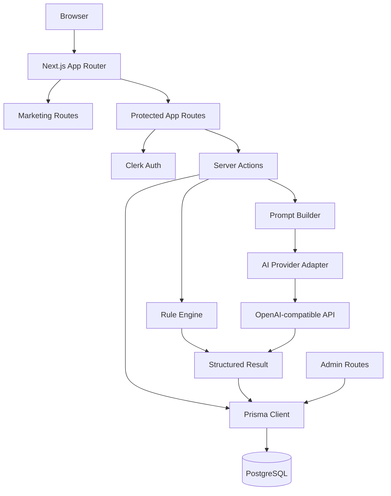

# Architecture

## 总览

Brand Tone Checker 使用 Next.js App Router 构建全栈应用。页面、server actions、认证、数据库访问和 AI 调用都在同一个代码库内组织，通过清晰的模块边界降低业务逻辑和外部服务的耦合。

## 目录结构

| 路径 | 职责 |
| --- | --- |
| `app/` | Next.js 路由、布局、加载态、错误边界和 server actions。 |
| `app/(marketing)/` | 公开营销官网。 |
| `app/(app)/` | 登录后应用区，包括 dashboard、profiles、check、checks 和 admin。 |
| `components/` | 页面组件、表单组件、展示组件和基础 UI 状态组件。 |
| `lib/` | 业务规则、AI 抽象、Prompt builder、历史结果结构、i18n 和 Prisma client。 |
| `lib/ai/` | Tone Check 的 AI provider 边界、结果解析和类型定义。 |
| `lib/prompt/` | Prompt 结构、模板和构建测试。 |
| `prisma/` | Prisma schema 和迁移。 |
| `docs/` | 产品、架构、部署和开发说明。 |

## 路由层

公开区：

- `/`：营销官网。
- `/sign-in`：Clerk 登录页。
- `/sign-up`：Clerk 注册页。

受保护应用区：

- `/dashboard`：登录后的工作台。
- `/profiles`：品牌档案列表。
- `/profiles/new`：新建品牌档案或生成 Brand Brain 草稿。
- `/profiles/[id]`：编辑品牌档案。
- `/check`：提交 Tone Check。
- `/checks`：查看历史报告列表。
- `/checks/[id]`：查看单条历史报告详情。
- `/admin`：只读后台总览。
- `/admin/users`：只读用户列表。
- `/admin/ai-logs`：只读 AI 调用日志。

## 认证与权限

Clerk 负责用户登录、注册和当前用户身份。受保护页面通过 Clerk server helpers 获取用户，并在需要时创建或更新本地 `UserProfile`。

Admin 权限由 `ADMIN_EMAILS` 控制。只有当前 Clerk 用户邮箱命中管理员列表时，才能访问只读后台。

## 数据模型

当前 Prisma 模型包括：

- `UserProfile`：本地用户资料，关联 Clerk user id、邮箱、套餐、品牌档案、质检记录、使用日志和 AI 日志。
- `BrandProfile`：品牌档案，保存受众、语气标签、禁用词、必用词和示例文案。
- `Check`：单次质检结果，保存输入文案、分数、问题、改写和结构化结果字段。
- `UsageLog`：预留的使用计数记录。
- `AiCallLog`：AI 调用记录，保存 provider、model、状态、token 信息和错误信息。

当前枚举包括：

- `Plan`：`FREE`、`PRO`、`AGENCY`。
- `AiCallStatus`：`SUCCESS`、`FAILED`。

## Tone Check 流程

1. 用户在 `/check` 选择 Brand Profile。
2. 用户补充平台、受众、目标和语言。
3. Server action 校验用户、品牌档案和输入长度。
4. 系统检查 Brand Brain 是否足够完整。
5. `runRuleEngine` 执行确定性规则检查。
6. Prompt builder 组织品牌档案、上下文和文案。
7. AI provider adapter 调用 OpenAI-compatible API。
8. `parseToneCheckResult` 解析并规范化 AI 返回的结构。
9. 系统合并规则、AI 结果和上下文。
10. Prisma 保存 `Check` 和 `AiCallLog`。
11. 页面展示结构化报告，并提供历史报告入口。

## AI 边界

AI 调用通过 `lib/ai/providers.ts` 和 `lib/ai/openai-compatible-provider.ts` 抽象。业务层依赖内部 `AiProvider` 接口，不直接绑定具体模型供应商。

当前支持：

- `AI_PROVIDER=openai-compatible`
- `OPENAI_COMPATIBLE_BASE_URL`
- `OPENAI_COMPATIBLE_API_KEY`
- `OPENAI_COMPATIBLE_MODEL`

这种边界让后续替换模型供应商时尽量集中在 provider adapter 内。

## 历史结果结构

`Check` 表保存基础字段：

- 原始输入
- 分数
- 问题列表
- 改写
- `tagHits` JSON

`tagHits` 中保存结构化扩展信息：

- final decision
- confidence
- evidence
- checks
- suggestions
- matched / missing / violated rules
- context

`lib/check-history.ts` 负责把历史记录恢复成当前前端可展示的 `ToneCheckResult`。

## 可维护性边界

- Prompt 模板集中在 `lib/prompt/`，业务页面不直接拼 Prompt。
- AI provider 抽象集中在 `lib/ai/`，业务页面不直接调用模型接口。
- 数据库访问集中在 server components、server actions 和 admin 查询中。
- 表单规则和计划限制放在 `lib/brand-profile-rules.ts`，便于单独测试。
- 规则引擎放在 `lib/rule-engine.ts`，和 AI 语义判断保持分离。

## 架构演进方向

未来 V2 方向包括 Brand Workspace、Brand Brain、Brand Standard、Rule、Evidence、Knowledge Item、Workflow、Approval、Feedback 和 Analytics Snapshot 等对象。当前文档仅描述现有实现，V2 设想见 `docs/architecture-v2.md`。
